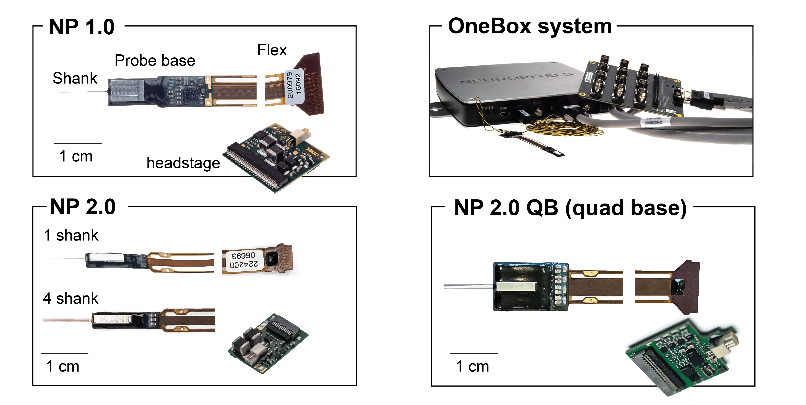
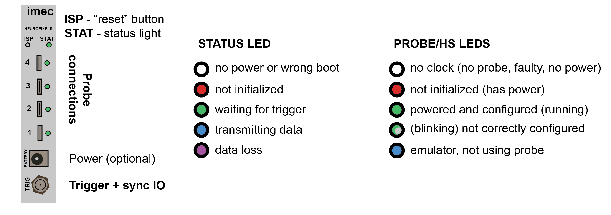

# JHU-neuropixels-2025

This repository contains files for the _Python_ tutorials in the 2025 JHU Neuropixels course. 

The goal of the tutorials is to show how to navigate spike sorting outputs to retrieve data and make plots and how data are structured, so we use mostly standard python libraries.

### Outline:

  1. References and links
  2. Installing a **python environment**
  3. Brief description of Neuropixels hardware
  4. Introduction to file formats
  5. Notebook tutorials

### Brief description of Neuropixels hardware

The recording hardware is modular, we will describe what different parts of the system are for and how they are different from other systems:
1. the shank,
2. the probe base,
3. the headstage, and
4. the basestation (a.k.a. Neuropixels module)

The main difference between Neuropixels and typical recording devices is that the electrodes and digitizers are combined using CMOS technology in an Application Specific Integrated Circuit (ASIC).

In typical systems, the shank has just passive wires to the electrodes and the signals are amplified in the headstage, and then further digitized close to the computer.

In the case of Neuropixels, the shank and the probe base make up the ASIC; the headstage transmits already digitized data to an acquisition module that synchronizes data from different streams and sends it to the computer. Digitization happens very close to the brain with Neuropixels - leaving less space for noise and interference. 

To learn more about how this works dig into the Neuropixels [MANUAL](https://www.neuropixels.org/_files/ugd/832f20_ba7f3e9e639b49809458cf64d76abdcc.pdf) and [Putzeys et al. 2019](https://ieeexplore.ieee.org/document/8846063/)

### Shank and probe base

The shank is around 10 mm long for Neuropixels 1.0 and 2.0 and contains many 12x12um Titanium Nitride (TiN) electrodes which allow recording both action potentials from single neurons and capturing local field potentials. The probe head digitizes 384 channels and multiplexes the signals in time.

The electrodes are arranged differently for NP1.0 and NP2.0.

**Neuropixels 1.0**:
 - cross section is 70x24um 
 - tip length of 175 um
 - the electrodes are aranged in a checkerboard pattern
 - the electrodes are spaced 16um horizontaly and 20um vertically
 - there are 960 selectable sites with adjustable gain
 - these probes have a 10-bit analog to digital converter and split the AP (highpass) and LFP (low pass) bands in separate streams

**Neuropixels 2.0**:
 - will be available soon and can have 4 shanks,separated by 250um
 - the tip length is around 200um
 - the electrodes are Linearly aranged, spaced 32um horizontaly and 15um vertically
 - each shank has 1280 selectable sites (aranged in a 2 by 640 array)
 - the signals are amplified with fixed gain, and the AP and LFP bands are combined and digitized with 12-bit precision.

### Headstage

The signals come through the Flex alread multiplexed in time. The headstage will then serialize the data and send it to the computer. In addition, the headstage also provides a stable source of power to the ASIC and the master clock used for digitization.

The headstage for Neuropixels 2.0 can carry 2 probes thus enabling recordings from 384*2 channels, which is ideal for recording chronically from mice with 2 probes. 

### Base station and acquisition system

There are 2 systems to record with neuropixels, the **OneBox** and the **PXI system**. 

The **OneBox** system was developped by [__imec__](https://www.neuropixels.org/system1-0) as a dedicated, user-friendly acquisition system for acquiring data with neuropixels.

The system works with USB3 and allows acquiring from 2 headstages simultaneously (_2x 1.0 probes_ and up to _4x Neuropixels 2.0 probes_). 

The **PXI system** consists of:
 1. a chassis, to hold all acquisition components (like the _PXIe-1083_)
 2. the neuropixels module (that is purchased from [__imec__](https://www.neuropixels.org/system1-0))
 3. a data acquisition card (DAQ - like the _PXIe-6341_)
 4. a breakout box (to interface with the DAQ, like the _BNC-2110_)

Check the [simplified shopping list](https://github.com/billkarsh/SpikeGLX/blob/master/Markdown/SystemRequirements_PXI.md#pxi-simplified-shopping-list) put together by __Bill Karsh__.

The **neuropixels module** is an FPGA device that handles synchronization and reads data from the headstages. It can connect to up to 8 NP2.0 probes or 4 NP1.0.
The image below is a quick reference for how to interpret the LED's in the device.

You'll also need a **computer**, best to use a dedicated station or laptop. The [hardware requirements](https://github.com/billkarsh/SpikeGLX/blob/master/Markdown/SystemRequirements_PXI.md) are described in detail by _Bill Karsh_ (author of SpikeGLX, working with Tim Harris at HHMI Janelia).

In short, the _minimum requirements_ for an **acquisition computer**  are:

 - 64 bit Windows 10 or 11 (_[Enclustra drivers](https://billkarsh.github.io/SpikeGLX/Support/Enclustra_Win10&11.zip) needed for PXIe system_)
 - dedicated SSD, NVME drive or RAID drive that supports at least the [twice the output data rate you will be streaming](https://github.com/billkarsh/SpikeGLX/blob/master/Markdown/SystemRequirements_PXI.md#drive)
 - working best on _intel_ systems with at [least 4 cores](https://github.com/billkarsh/SpikeGLX/blob/master/Markdown/SystemRequirements_PXI.md#acquisition-cpu) (_AMD_ only works with the OneBox system)
 - 32Gb RAM minimum (check the advice on [configuring RAM](https://github.com/billkarsh/SpikeGLX/blob/master/Markdown/SystemRequirements_PXI.md#ram))
 - at least **USB 3.0 for OneBox**
 - PCIe 8x slot for **PCI based PXIe controllers** These controllers are no longer sold by _NationalInstruments_ but may still be present in many labs.
 - Thunderbolt enabled for [**thunderbold PXIe**](https://www.ni.com/en-us/shop/model/pxie-1083.html?partNumber=787026-01)

### Installing a python environment

